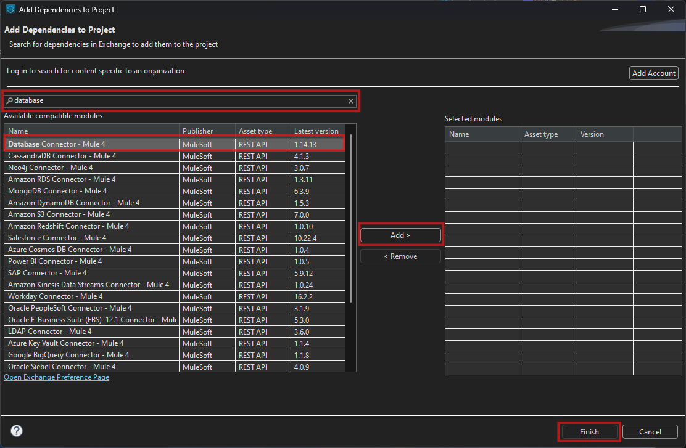
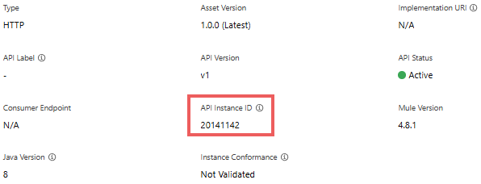
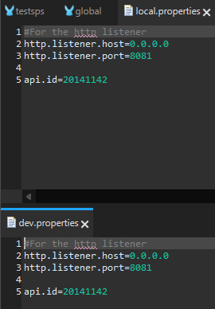

<div align="center">


# **MuleSoft Trainee Practice**

**Author:**  
Diego Castellanos Delgado

---

 **Date:**  
January 3, 2025

---

 **Description:**  
Documentation corresponding to the practice carried out for the **MuleSoft Trainee** training program.  
Includes the development and conclusions of the project.

---

</div>

<!-- pagebreak -->
<div style="page-break-after: always;"></div>

- [**MuleSoft Trainee Practice**](#mulesoft-trainee-practice)
  - [Prerequisites](#prerequisites)
  - [1. Getting Started](#1-getting-started)
      - [The goal](#the-goal)
  - [2. Creating the project](#2-creating-the-project)
    - [Connection to the Database](#connection-to-the-database)
    - [Configuring the Database Query](#configuring-the-database-query)
    - [Configuring the Database Response Flow](#configuring-the-database-response-flow)
      - [Transform the Database Data to JSON Format](#transform-the-database-data-to-json-format)
      - [Set the Payload for the HTTP Response](#set-the-payload-for-the-http-response)
      - [Configure the HTTP Listener and Response](#configure-the-http-listener-and-response)
    - [Run the Mule Application Locally](#run-the-mule-application-locally)
    - [Configuring Global Elements and Properties Files](#configuring-global-elements-and-properties-files)
      - [Setting up a global.xml file for managing global elements](#setting-up-a-globalxml-file-for-managing-global-elements)
    - [Move hardcoded values to external properties](#move-hardcoded-values-to-external-properties)
    - [Configure the Properties Global Element](#configure-the-properties-global-element)
    - [Securing Properties](#securing-properties)
      - [Creating the file](#creating-the-file)
      - [Encrypting Property File Values](#encrypting-property-file-values)
      - [Adding the Encrypted Value to the Properties Files](#adding-the-encrypted-value-to-the-properties-files)
      - [Testing the Application Locally](#testing-the-application-locally)
    - [Verifying the Application](#verifying-the-application)
      - [Deploying to CloudHub with Secure Credentials](#deploying-to-cloudhub-with-secure-credentials)
      - [Hiding the `secure.key` Value in `mule-artifact.json`](#hiding-the-securekey-value-in-mule-artifactjson)
    - [Result:](#result)
  - [3. Create the API Specification](#3-create-the-api-specification)
    - [Data Type](#data-type)
    - [Define the Specification Resource](#define-the-specification-resource)
    - [Test the API Using the Mocking Service](#test-the-api-using-the-mocking-service)
    - [Publish the API to Anypoint Exchange](#publish-the-api-to-anypoint-exchange)
  - [Set Up a New API in API Manager](#set-up-a-new-api-in-api-manager)
    - [Set Up API Autodiscovery in Anypoint Studio](#set-up-api-autodiscovery-in-anypoint-studio)


<!-- pagebreak -->
<div style="page-break-after: always;"></div>

## Prerequisites

* ### **Anypoint Platform**  
    An **Anypoint Platform** account will be required to host the application on **CloudHub**.  
    A free trial account can be obtained [here](https://anypoint.mulesoft.com/login/signup?apintent=generic).

* ### **Anypoint Studio**  
    MuleSoft’s IDE. **Anypoint Studio** allows the building of APIs and integrations more quickly.  
    **Anypoint Studio** can be downloaded [here](https://www.mulesoft.com/platform/studio).

* ### **REST Client**  
    A REST client will be needed. Download and install any client of choice. 
    For this walkthrough, **Postman** will be used *(A Postman account is not required for the process)*.  
    It can be downloaded [here](https://www.postman.com/downloads).

    <div align="center">

    

    </div>


<!-- pagebreak -->
<div style="page-break-after: always;"></div>

## 1. Getting Started

#### The goal

At SPS, the marketing team needs to have the customers' information available in order to generate personalized campaigns that improve customer experience and satisfaction. This information is stored in a database.
In order to display this information, an API needs to be developed so that it connects to the database to query this information.

------------

The database uses MySQL as its manager and the query to be perform is the following:

```sql
SELECT * FROM customers;
```
The database connection values are as follows:

<table>
  <thead>
    <tr>
      <th>Property</th>
      <th>Value</th>
    </tr>
  </thead>
  <tbody>
    <tr>
      <td>Host</td>
      <td>mudb.learn.mulesoft.com</td>
    </tr>
    <tr>
      <td>Port</td>
      <td>3306</td>
    </tr>
    <tr>
      <td>User</td>
      <td>mule</td>
    </tr>
    <tr>
      <td>Password</td>
      <td>mule</td>
    </tr>
    <tr>
      <td>Database</td>
      <td>training</td>
    </tr>
  </tbody>
</table>

------------

## 2. Creating the project

After opening Anypoint Studio, you'll be prompted to select a workspace—a directory on your computer where project files will be saved. Once the workspace is set and the application is running, navigate to `File` in the top menu and choose `New -> Mule Project` to create a new project.

Anypoint Studio will display the *New Mule Project wizard*. For this project, enter `TestSPS` in the **Project Name field**, leave all other settings as default, and click Finish to proceed.

<div align="center">


</div>

Anypoint Studio will create a new blank project. The example below outlines the various views you’ll use to design and build a Mule project:

<div align="center">


<table>
  <thead>
    <tr>
      <th>Color</th>
      <th>Section</th>
      <th>Details</th>
    </tr>
  </thead>
  <tbody>
    <tr>
      <td>Red</td>
      <td>Package Explorer</td>
      <td>Displays the project's structure, including files and folders.</td>
    </tr>
    <tr>
      <td>Blue/Purple</td>
      <td>Properties Editor and Console</td>
      <td>Used to configure connector attributes and view application logs for debugging.</td>
    </tr>
    <tr>
      <td>Pink</td>
      <td>Mule Palette</td>
      <td>Provides access to prebuilt Anypoint Connectors and Core Connector components for building applications.</td>
    </tr>
    <tr>
      <td>Green</td>
      <td>Canvas</td>
      <td>A workspace for designing message flows using drag-and-drop Modules from the Mule Palette.</td>
    </tr>
  </tbody>
</table>

<div style="font-size:11px">
source: <a href="url">https://developer.mulesoft.com/tutorials-and-howtos/getting-started/hello-mule/</a>
</div>

</div>

---

From the Mule Palette, drag and drop an `HTTP Listener` onto the canvas. Anypoint Studio will automatically place the connector within a flow when added to the canvas.

<div align="center">


</div>

An HTTP Listener acts as an HTTP endpoint that waits for incoming HTTP requests at the URL you specify.

To configure it, click on the HTTP Listener connector, and in the **Properties Editor** below, select the green plus `(Add)` button. This will generate a configuration file within your **Global Elements Configuration**. Review the default settings, and once confirmed, click OK to finalize the configuration.

<div align="center">


</div>

In the **General** section of the Listener, locate the **Path** field and enter `/api/v1/sps/customers`.

<div align="center">


</div>


### Connection to the Database  


To enable database interactions in the project, the **Database Connector** will need to be added. This process updates the XML code with the connector’s namespace and schema location and includes the necessary dependencies in the project’s `pom.xml` file.  

1. Open the **Mule Palette** and select the **(X) Search in Exchange** option.  
2. In the **Add Dependencies to Project** window, search for **Database**.  
3. Select **Database Connector** from the available modules and click **Add**.  
4. Click **Finish** to complete the addition.  

<div align="center">



</div>

Once added, the connector will be ready for configuration within the flow.

<!-- pagebreak -->
<div style="page-break-after: always;"></div>

### Configuring the Database Query  

* Drag the **Select** component from the **Database Connector** into the flow.  
* Connect the **Select** component to the **HTTP Listener** flow.  
  
* Click the green plus (**Add**) button to configure the connection settings with the provided database credentials. *Use **MySQL Connection** in the Connection dropdown*

    >Note: A MySQL JDBC Driver is required to use as the Library. You can either use the recommended libraries or install local ones. 
    >
    >In this case, the recommended libraries were not functional, so the 8.0.26 MySQL JDBC Driver was used *(obtain [here](https://downloads.mysql.com/archives/c-j/). Using the Platform Independent OS option).*
    >
    > This process will also automatically update the `pom.xml` file to reference the new library.

    

* In the **Query** section of the **Select** component, enter the following SQL query:  
   ```sql
   SELECT * FROM customers;
   ```  
   

This configuration enables the flow to retrieve data from the database.

Finally, go to **File** in the top menu and select **Save** to save the progress.

### Configuring the Database Response Flow

>To avoid errors in the flow, the database query result must be transformed into a proper response format (e.g., JSON) before sending it back. If the transformation is skipped, it may result in a runtime error indicating that invalid data is being sent through the HTTP response.

#### Transform the Database Data to JSON Format

To convert the data returned by the database query into a JSON format, follow these steps:

* Step 1: Add a Transform Message component to the flow after the db:select component.

* Step 2: Double-click the Transform Message component to open the DataWeave editor. Enter the following DataWeave script to transform the database results into a JSON format:

DataWeave Script:
```dw
%dw 2.0
output application/json
var customers = payload
---
customers
```

This script takes the payload (which is the result from the db:select component) and outputs it as a JSON object.

* Step 3: Save and close the DataWeave editor to apply the transformation.

#### Set the Payload for the HTTP Response

To send the transformed data as the HTTP response, follow these steps:

* Step 1: After the Transform Message component, add a Set Payload component to the flow.

* Step 2: In the Set Payload component, ensure the Value field is set to `#[payload]` to send the transformed data from the previous step as the response payload.

#### Configure the HTTP Listener and Response

Ensure that the HTTP Listener is configured properly to receive the incoming request and send the response by verifying that the `Listener Config` is correctly set up with the appropriate host, port, and path. 

Once all these steps are completed, the flow should appear as follows:


### Run the Mule Application Locally

Right-click on the canvas and select **Run project testsps** to run and test your project locally on your computer.

<div align="center">


</div>

Go to the **Console** view to check if your application has been successfully deployed. If you see **DEPLOYED** at the bottom right, your application is ready, and you can use a REST Client to test your first Mule Application.


Open your preferred **REST Client**. Enter the URL of your HTTP endpoint, followed by the path you added earlier. For this demo, you will use the following address:  
`http://localhost:8081/api/v1/sps/customers`

<div align="center">


</div>

---

### Configuring Global Elements and Properties Files

#### Setting up a global.xml file for managing global elements

It is recommended to create a new `global.xml` file to store all global elements. This approach helps maintain organization when working with multiple XML files, preventing the need to search for global elements in each individual file.

To create the new file, right-click on the `src/main/mule` folder and select **New** > **Mule Configuration File**.

Name the file as `global.xml` and click **Finish**.

Return to the `testsps.xml` file and switch to the **Configuration XML** view. Locate the `<http:listener-config>` and `<db:config>` elements, then cut everything between their respective tags.

Navigate to the `global.xml` file and switch to the **Configuration XML** view. Paste the copied code inside the `<mule>` tags. If you receive an alert about the `doc:id` values, select **Yes** to regenerate the IDs for each component; do not select the checkbox.

Click the **Save All** button located at the top left of the screen to save all your changes.

<div align="center">


</div>

### Move hardcoded values to external properties

To minimize the use of hardcoded values in the code, it is considered a best practice to externalize them into properties files. Right-click on the `src/main/resources` folder and select **New > File**.

* Create a file named `local.properties` in the `src/main/resources` folder.
* Open the newly created `local.properties` file and add the following properties:  

  ```properties
  #For the http listener
  http.listener.host=0.0.0.0
  http.listener.port=8081

  # To secure the username and password of the remote DB
  db.connetion.username = mule
  db.connetion.password = mule
  ```

> Note: For now we'll copy the username and password used by the database, later will use secure properties to protect them.  

Save the file after adding these entries.

Follow the same steps to create a `dev.properties` file under the `src/main/resources` folder:  

1. **Right-click** on the `src/main/resources` folder.  
2. **Select** `New > File`.  
3. **Name the file** `dev.properties` and click `Finish`.  

Open the `dev.properties` file and add the same properties as in `local.properties`:  

```properties
  #For the http listener
  http.listener.host=0.0.0.0
  http.listener.port=8081

  # To secure the username and password of the remote DB
  db.connetion.username = mule
  db.connetion.password = mule
```  

Save the file after adding these entries.  

<div align="center">


</div>

>*Note:*  Although both files currently share the same values, separating the properties by environment (e.g., local and development) is a good practice. This allows flexibility when configuring different environments, such as deploying the application to CloudHub or other platforms.

Return to the `global.xml` file and navigate to the **Global Elements** view. Select the `HTTP_Listener_config` element and click **Edit**.  

To reference a property from a connector configuration, apply the following syntax:

```properties
${your.property.name}
```

Replace each hardcoded value in each element with the corresponding property using this syntax.

<div align="center">


</div>

> Do the same process for the `database: SELECT ` element, using it's corresponding values

<div align="center">


</div>


### Configure the Properties Global Element

Adding the properties file alone is not sufficient to make the Mule Application recognize its location. If the application is run without this configuration, an error will occur, indicating that the properties could not be found.

In the `global.xml` file, switch to the Global Elements view. Click on "Create" to add a new global element. Search for "Configuration properties," select the element, and click "OK."

Since we are not using static properties files, we need to ensure the Mule Application can switch between files depending on the environment. To accomplish this, the following property reference syntax will be used:

```properties
${env}.properties
```

This way, the system will dynamically load the appropriate properties file based on the value of the `env` variable, allowing for different configurations depending on the environment. Click OK.

<div align="center">


</div>

Now that the Configuration properties element has been added to the global.xml file, the next step is to define the `env` property that was referenced earlier.

1. Click **Create** and select **Global Property**.
2. Set the **name** to `env` and the **value** to `local`.
3. Click **OK** to create the property.
4. Save all files.

>This setup ensures that the application will load the `local.properties` file based on the value of the `env` property.

<div align="center">


</div>

Navigate to any of the XML files and switch to the Message Flow view. Right-click inside the canvas and select **Run project**.

Navigate to your REST client and send a request to the local application. Everything should function as expected.

### Securing Properties

Now that the global properties have been set up, the next step is to protect the database credentials using a secure properties files.

It is a best practice to separate the secure properties in files per environment.

#### Creating the file

To create a `local.secure.properties` file, navigate to `src/main/resources`, right-click, and select `New > File`. Name the file `local.secure.properties`. 

Move the database credentials from the `local.properties` file and place them into the `local.secure.properties` file.

After adding the database credentials to the `local.secure.properties` file, repeat the process to create a `dev.secure.properties` file.

Next, locate the `Mule Secure Configuration Properties` module in Exchange. Open the `global.xml` file, navigate to the Mule Palette, and select the **Search in Exchange** option. Search for the module, then click **Add** to include it in your project.

<div align="center">


</div>

After importing the Secure Properties module, follow these steps:  

1. Open the **Global Elements** view.  
2. Click the **Create** button and select **Secure Properties Config** from the options.  
3. In the **File** field, enter `${env}.secure.properties`. This creates a dynamic reference, allowing the Mule application to determine the appropriate file (e.g., `local.secure.properties`) based on the value of the `env` property.  
4. In the **Key** field, enter `${secure.key}`.  
5. Select **Blowfish** as the algorithm.  

<div align="center">


</div>

>**Note:** The `secure.key` value should not be directly included in your code, as it can pose a security risk. Instead, pass the key dynamically at runtime—either when running the application locally or deploying it remotely. The process for passing this key is covered in a later step.

#### Encrypting Property File Values  

To encrypt the values in the properties files, follow these steps:  

1. **Download the Secure Properties Tool**  
   Obtain the [Secure Properties Tool Jar](https://docs.mulesoft.com/mule-runtime/latest/secure-configuration-properties#secure_props_tool) file from the official MuleSoft documentation.  

2. **Run the Encryption Command**  
   Open a terminal or command line prompt in the directory where the Jar file is located. Execute the following command:  

   ```powershell
   java -cp secure-properties-tool.jar com.mulesoft.tools.SecurePropertiesTool `
   string `
   encrypt `
   Blowfish `
   CBC `
   MyMuleSoftKey `
   "mule"
   ```  

   - Replace `MyMuleSoftKey` with the secure key you plan to use for encryption *(This process uses this key)*.  
   - Replace `"mule"` with the value to encrypt (e.g., the database username or password).

3. **Copy the Encrypted Value**  
   The command will return an encrypted version of the provided value. For instance, it will generate an encrypted string for the value `mule`.  

4. **Update the Properties File**  
   Replace the original unencrypted values in your `local.secure.properties` or `dev.secure.properties` file with the encrypted values.  


> Note: The encryption key (`MyMuleSoftKey`) will become the `secure.key` property defined in your configuration. This ensures the application can decrypt and use the values during runtime.
  
#### Adding the Encrypted Value to the Properties Files  

After obtaining the encrypted value, you need to include it in the properties file using the following syntax:  

```plaintext
![encryptedValue]
```

For example, if the encrypted value returned by the tool is `hn5PdGLGVPw=`, the entry in your `local.secure.properties` or `dev.secure.properties` file will look like this:  

```plaintext
db.connection.password=![hn5PdGLGVPw=]
```

<div align="center">


</div>

>Key Points:
> * The `![...]` syntax ensures Mule recognizes the value as encrypted. 
>  
> * Save all files after making changes.

Next, an update to the Database Configuration Element is needed.

1. **Return to the Global Configuration (global.xml)**  
   In Anypoint Studio, navigate to the `global.xml` file where the database configuration is stored.

2. **Switch to the Global Elements View**  
   - Ensure you're in the **Global Elements** view.
   - Locate the **Database Config** global element

3. **Edit the Database Configuration**  
   - Select the **Database Config** global element and click **Edit**.
   - Look for the fields where the database `user` and `password` are configured.

4. **Update the Username and Password Fields**  
   - Update the **username** field by changing the value to the following:
     ```plaintext
     ${secure::db.connection.username}
     ```
   - Similarly, update the **password** field to:
     ```plaintext
     ${secure::db.connection.password}
     ```
   - This ensures that the application will reference the encrypted values stored in the `local.secure.properties` or `dev.secure.properties` file at runtime.

5. **Save the Changes**  
   After making the changes, click **OK** or **Save** to apply the updates to the database configuration.


<div align="center">


</div>

This step is crucial because the `secure::` prefix tells Mule to decrypt these values at runtime using the `secure.key`. Without this, the values would remain encrypted, causing connection errors.


#### Testing the Application Locally  

1. Right-click on your Mule project and select **Run As > Run Configurations**.  
2. In the **Run Configurations** window, go to the **Environment** tab.  
3. Click **Add** to add a new environment variable.  
4. Input the following:
   - **Name**: `secure.key`
   - **Value**: `MyMuleSoftKey`
5. Click **OK** to confirm the addition of the environment variable.  
6. Click **Apply** and then **Run**. This will set the `secure.key` property at runtime, without hardcoding it into your application.

<div align="center">


</div>

By passing the key at runtime, it ensures that the key is not saved directly in the source code, which helps to prevent potential security breaches.  

### Verifying the Application  

Once the application has been deployed successfully (you should see the **DEPLOYED** status in the console), go back to your REST client (e.g., Postman).  

- Send a **GET** request to `http://localhost:8081/api/v1/sps/customers`.  
- Check the response to ensure the application is correctly processing the request and interacting with the database securely.

#### Deploying to CloudHub with Secure Credentials

To deploy the Mule application to CloudHub with secure credentials, the steps are as follows:

1. **Sign in to Anypoint Platform**  
   - Open your browser and navigate to the [Anypoint Platform](https://anypoint.mulesoft.com/).
   - Sign in with your credentials.

2. **Go to Runtime Manager**  
   - In the **Runtime Manager**, select the environment where you want to deploy the application. *(Sandbox is used in this case)*

3. **Select Your Application**  
   - From the list of previously deployed applications, select the application you wish to update with secure credentials.

4. **Go to the Properties Tab**  
   - Once the application details page is open, navigate to the **Properties** tab.

5. **Add the Required Properties**  
   - In the **Properties** tab, click on **Add Property** to add the necessary properties.
   - Add the following two properties:
     - **`env`**: Set the value to the environment you want to use (for example, **`dev`**).
     - **`secure.key`**: Set this property to the encryption key used for decrypting secure values.

6. **Apply Changes**  
   - After adding the properties, click on **Apply Changes** to save the configuration.

> Notes: 
> - Ensure that the `env` property is set to refer to the correct environment properties.
> 
> - The `secure.key` is used to decrypt secure values, so ensure it is managed securely.

By following these steps, the application will be deployed with the required secure credentials, ensuring that it accesses the correct values during runtime.
#### Hiding the `secure.key` Value in `mule-artifact.json`

To hide the `secure.key` value in your application’s configuration and prevent it from being exposed, follow these steps:

1. **Open the `mule-artifact.json` File**  
   - In Anypoint Studio, navigate to your project’s `src/main/resources` folder and open the `mule-artifact.json` file.

2. **Edit the `mule-artifact.json` File**  
   - Add the following line before the closing brackets `}`. Make sure to include a comma at the end of the `"minMuleVersion"` line to separate it from the new entry:

   ```json
   "secureProperties": ["secure.key"]
   ```

   This line tells MuleSoft to treat the `secure.key` property as a secure property and prevents it from being exposed in logs or any other configurations.

3. **Save the Changes**  
   - Save the `mule-artifact.json` file.

### Result:
After adding this configuration, the `secure.key` property will be securely hidden from the logs and configuration outputs, ensuring that sensitive information remains protected.

## 3. Create the API Specification

To begin, log in to your Anypoint Platform account. Once logged in, navigate to **Design Center**. Click the **Create +** button and select *New API Specification*.

A pop-up window will appear, offering different options to set up the specification. Start by giving your API a title. In this example, the title will be **SPS Customers DB API**.

You will then have the option to choose whether to use an API specification language or the guided visual editor to create your specification. The editor currently supports OAS and RAML. For this tutorial, we will use the visual editor, which will generate both specifications in real time. Select "Guide me through it" and proceed to Create API Specification.

Upon entering API Designer, you will see modules for the various specification components.

The first page you'll see is the API Summary module. Here, you can configure the title, communication methods (protocol and media type), base URI, and description of the API. You can either configure the API manually using the instructions below or import an existing API specification from Exchange (we will publish this specification to Exchange for future import). Use the following details:

<table style="margin-left:auto; margin-right:auto; border: 1px solid black;">
  <tr>
    <th>Field</th>
    <th>Value(s)</th>
  </tr>
  <tr>
    <td>Title</td>
    <td>SPS Customers DB API</td>
  </tr>
  <tr>
    <td>Version</td>
    <td>1.0.0</td>
  </tr>
  <tr>
    <td>Protocols</td>
    <td>HTTP, HTTPS</td>
  </tr>
  <tr>
    <td>Media type</td>
    <td>application/json</td>
  </tr>
  <tr>
    <td>Base URI</td>
    <td>mudb.learn.mulesoft.com</td>
  </tr>
  <tr>
    <td>Description</td>
    <td>An API for retrieving customer records from the SPS database.</td>
  </tr>
</table>


<div align="center">


</div>


On the right, RAML and OAS code is automatically generated as you update the specification in the visual editor.

The left pane offers options to configure security schemes, resources, and data types. Add the necessary data type and resource for the API. Select the + icon next to the data types tab and click on **Add data type**.

### Data Type

Create a data type for customers. Enter the following values for the fields:

<table style="margin-left:auto; margin-right:auto; border: 1px solid black;">
  <tr>
    <th>Field</th>
    <th>Value(s)</th>
  </tr>
  <tr>
    <td>Name</td>
    <td>customers</td>
  </tr>
  <tr>
    <td>Type</td>
    <td>Object</td>
  </tr>
  <tr>
    <td>Description</td>
    <td>Customer data type</td>
  </tr>
</table>

For each of the following properties, click the **Add Property** button:

<table style="margin-left:auto; margin-right:auto; border: 1px solid black;">
  <tr>
    <th>Property Name</th>
    <th>Required?</th>
    <th>Type</th>
    <th>Union?</th>
  </tr>
  <tr>
    <td>FirstName</td>
    <td>no</td>
    <td>String</td>
    <td>no</td>
  </tr>
  <tr>
    <td>LastName</td>
    <td>yes</td>
    <td>String</td>
    <td>no</td>
  </tr>
  <tr>
    <td>Email</td>
    <td>no</td>
    <td>String</td>
    <td>no</td>
  </tr>
  <tr>
    <td>Company</td>
    <td>no</td>
    <td>String</td>
    <td>no</td>
  </tr>
</table>

Finally, copy and paste the following example into the **Example** field at the bottom of the page. Click **Edit** to modify the pre-populated data.

```json
{
    "FirstName": "Maura",
    "LastName": "Wagstaffe",
    "Email": "mwagstaffe@npr.org",
    "Company": "Kazu"
}
```

<div align="center">


</div>

### Define the Specification Resource

Next, select the + icon next to the ***resources*** tab and choose **Add resource** as follows:

<table style="margin-left:auto; margin-right:auto; border: 1px solid black;">
  <tr>
    <th>Resource Path</th>
    <th>/api/v1/sps/customers</th>
  </tr>
  <tr>
    <th>Resource Method</th>
    <th>GET</th>
  </tr>
  <tr>
    <th>Resource Name</th>
    <th>Get list of customers</th>
  </tr>
</table>

<div align="center">


</div>

Configure the response for the `/api/v1/sps/customers` resource:

Select the **Responses** tab next to Summary and click on **Add New Response**.

Ensure the status code is **200 OK**, then click **Add Body**.

Ensure the Media Type is **application/json** and set the type to **Array**.

Expand the body from the right arrow (Details) and select the type *customers* that was created.


<div align="center">


</div>

### Test the API Using the Mocking Service

The API Designer offers a mocking service that simulates the behavior of an API specification. The mocking service generates a test link for an API and returns the responses (HTTP status codes and example payloads) as defined in your API specification.

Under **Select Server**, choose **Mocking Service**. This creates a dummy API request and displays the example response as if the API was live and returning data. Press **Send** to view the example response.

<div align="center">


</div>

### Publish the API to Anypoint Exchange

Click the **Publish** button at the top right and select **Publish to Exchange**.

In the new window, enter an asset version number to identify the version of this publication (separate from the API version). You can update the API specification and the asset version without affecting the API version, or you can release a new version of the API.

> The API version is inherited from the root file, which was configured using the visual editor. Set the asset version to **1.0.0** and click **Publish to Exchange**.


## Set Up a New API in API Manager

The initial step to managing an API and applying security policies is to set up a new API in API Manager. Navigate to API Manager within the Anypoint Platform, then select **Add API > Add new API**.

* In the Runtime, select **Mule Gateway**, then for *Proxy type*, choose Connect to existing application (basic endpoint), and select Mule version 4. Click **Next**.


  <div align="center">

  

  </div>

* On the next section, select **Create new API**, assign a name to the API, such as `testspsapi`, and select **HTTP API** as the type. Once done, click **Next**.


  <div align="center">

  

  </div>


* Leave Downstream and Upstream in default, click **Next**. Review the settings and click **Save**

Upon creating the new API, an **API Instance ID** will be generated. This ID is essential for linking the Mule application in Anypoint Studio with the API in API Manager.


<div align="center">



</div>

In your **Anypoint Studio** project, follow these steps to configure the API ID:  

1. Navigate to the **src/main/resources** folder.  
2. Open both the `local.properties` and `dev.properties` files.  
3. Add a new property named `api.id` in each file.  
4. Set the value of `api.id` to the API Autodiscovery ID obtained from **API Manager**.  

For example:  
**local.properties**  
```properties
api.id=your_local_api_id_here
```  

**dev.properties**  
```properties
api.id=your_dev_api_id_here
```  


<div align="center">



</div>


Save the changes to both files.

>**Note:** If additional environments, such as QA or PROD, are configured in **API Manager**, each environment will have a unique API ID. In such cases, ensure to update the corresponding properties files (e.g., `qa.properties` or `prod.properties`) with their respective API IDs.  

For this example, the focus is on syncing the API from **API Manager** to both the **dev** and **local** environments.

### Set Up API Autodiscovery in Anypoint Studio

Navigate to the **global.xml** file in your Anypoint Studio project and switch to the **Global Elements** view. Click on the **Create** button and choose **API Autodiscovery** from the available options.

In the **API Autodiscovery** configuration, use `${api.id}` to link the **API ID** field to the property created earlier. For the **Flow Name**, select `testspsFlow` as the flow name.


<div align="center">


</div>

Before running the application, add the necessary Client ID and Client Secret to connect to the API Manager. Navigate to Access Management in Anypoint Platform, select *Business Groups* click the environment *Sandbox*, and copy the Client ID and Client Secret. Then, include these values in the Deployment Properties and Anypoint Studio.

<div align="center">


</div>


Navigate to Anypoint Studio's preferences *(For Windows, on the top menu bar go to Window > Preferences)*. Then, go to **Anypoint Studio > API Manager**. Paste the Client ID and Client Secret copied from Access Management into the respective fields and click **Validate**. Ensure that the organization name matches the one displayed in the top-right corner of your Anypoint Platform account.


Once the settings are configured, click **Apply** and then **Apply & Close**. Run the Mule application, ensure that the application status shows as **DEPLOYED**.

`Open the REST Client and send a request to the local application.`

To deploy to CloudHub with environment credentials, follow these steps:

1. Open the **mule-artifact.json** file in Anypoint Studio.
2. Add the following properties to the **secure properties** list:

```json
"anypoint.platform.client_id",
"anypoint.platform.client_secret"
```

This will ensure these properties are hidden in Runtime Manager for security purposes.

Save and deploy to CloudHub, go to the Properties tab. Enter the Client ID and Client Secret like this:

```xml
anypoint.platform.client_id=<YOUR CLIENT ID>
anypoint.platform.client_secret=<YOUR CLIENT SECRET>
```

> Note: the properties may or may not appear hidden. The *Protect* Button can also toggle protected propeties.


<div align="center">


</div>


Once the application is deployed in Runtime Manager, the API status will be set to Active in API Manager.  This enables enforcing policies directly from API Manager without redeploying the Mule application.

